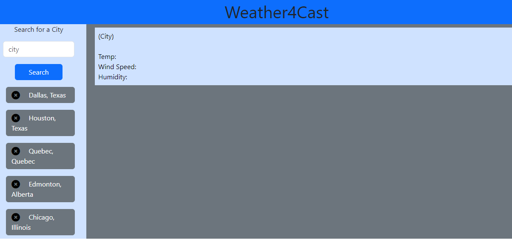
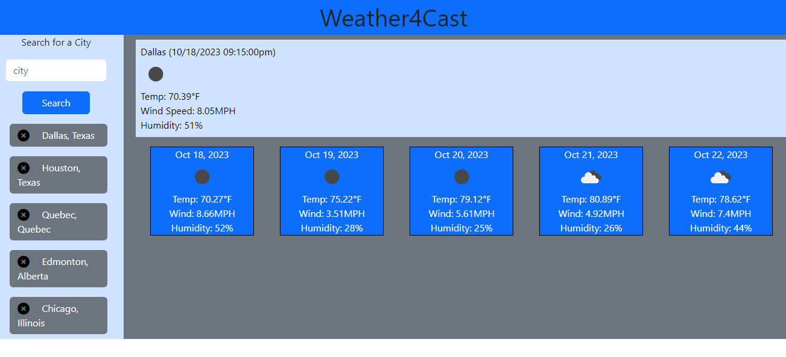
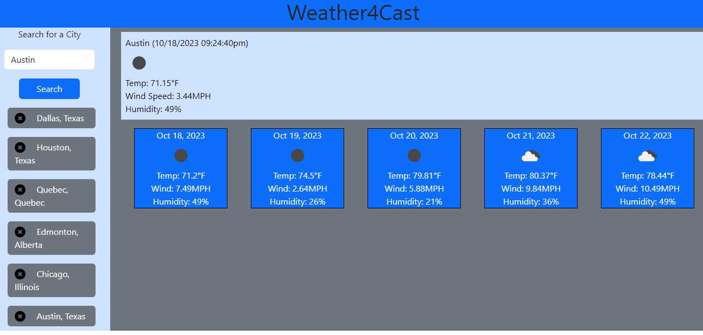
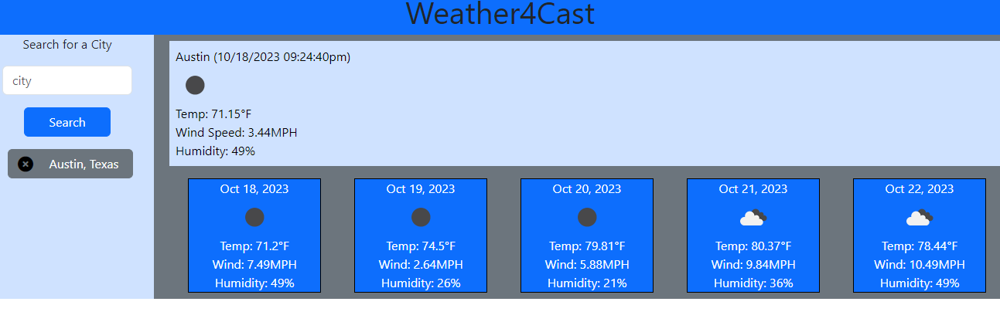

# Weather4Cast

## Description

```
This application works and explores the use of Server-APIs like OpenWeatherAPI to gain outsource data from the internet for the application. With this API, we can fetch location data like current and future weather from that city. In this application, we build a weather board with a search function to take a user's city of choice and populate the current weather, temp, wind speed, and humidity. It will also populate a 5-day forecast of the weather in that city as well. To enhance the application's function the user's search history will be stored locally allowing them to access previous searched cities.

- As the user loads the app, if any previous searches existed, the page would populate city buttons for the user and acquire options to re-access the weather of that city of choice. Otherwise, the user would input the city and search through the openweatherAPI for that city's weather data. Also, if the user wishes to clear some of the history of searches from locally, they can hit the close button adjacent to the city of choice and it will be removed.
```

## Screenshots





## Link

[live web application](https://fractalicecream.github.io/Weather4Cast/)

## User Story

```
AS A traveler
I WANT to see the weather outlook for multiple cities
SO THAT I can plan a trip accordingly
```

## Acceptance Criteria

```
GIVEN a weather dashboard with form inputs
WHEN I search for a city
THEN I am presented with current and future conditions for that city and that city is added to the search history
WHEN I view current weather conditions for that city
THEN I am presented with the city name, the date, an icon representation of weather conditions, the temperature, the humidity, and the wind speed
WHEN I view future weather conditions for that city
THEN I am presented with a 5-day forecast that displays the date, an icon representation of weather conditions, the temperature, the wind speed, and the humidity
WHEN I click on a city in the search history
THEN I am again presented with current and future conditions for that city
```

